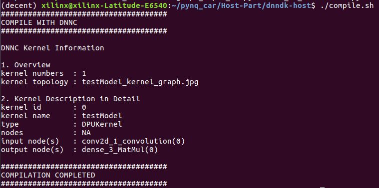

<!--
 * @Author: Sauron Wu
 * @GitHub: wutianze
 * @Email: 1369130123qq@gmail.com
 * @Date: 2019-10-15 16:38:14
 * @LastEditors: Please set LastEditors
 * @LastEditTime: 2019-10-30 17:42:48
 * @Description: 
 -->
# What you will learn
- How to use dnndk to do quantization to the model.
- How to use dnndk to compile the model(make DPU understandable .elf files).

# Using DNNDK
1. Make sure that you have installed the DNNDK-v3.0 correctly. You can refer to [this](https://github.com/wutianze/dnndk3.0-pynqz2/blob/master/build-host-dnndk.md) if you don't know how to install and use DNNDK.
2. Go into the `dnndk-host` directory, run `./freeze_detect.sh` to transfer the .h5 model to .pb model and it will output the input_node and output_node info in your window. Remember the info and we will use them later. You can see the following pictures, it will first transfer the .h5 model to .pb model and then print its information.  

3. Edit `quant.sh`, change the `--input_nodes conv2d_1_input --input_shapes ?,80,160,3 --output_nodes dense_3/Softmax` according to the info you get and the images' property you use as training data.  
4. Edit `graph_input_fn.py`, change the `CONV_INPUT` to `--input_nodes` in `quant.sh`. 
5. Edit `compile.sh`, make a name for your model by changing `--net_name`.
6. Run `./quant.sh && compile.sh`, it will do quantization to the trained model and build .elf files which can be used by DPU. You can see the info printed in your screen if nothing goes wrong. You must remember the info printed and they will be used later in Pynq-Part. 

7. Copy the .elf files in `compile/` to the `Pynq-Part/Car/model/` and then move the Car directory to your Pynq-Z2 board.

# Now please read the `Pynq-Part/Car/guides/run_guide.md`.
