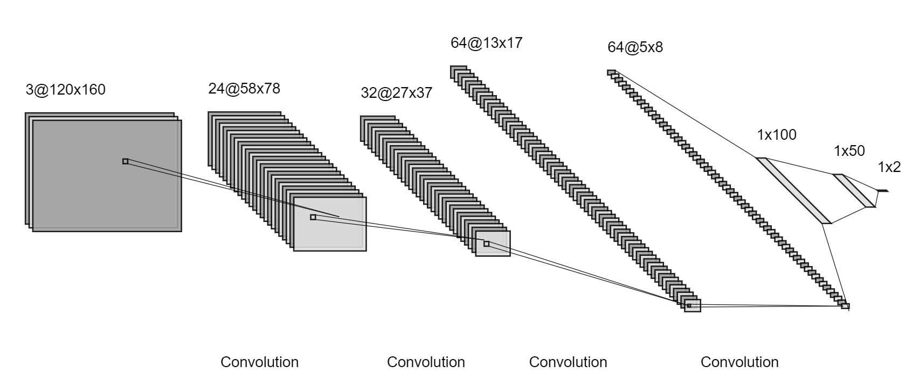

# Guide For Developer
Show you the detail of HydraMini in Host-Part including preprocess, model structure, what is DPU and graph_input_fn detail.

# Preprocess Edit
Read the file `process_img.py` and what you need to edit is the function `image_handle()`, you can do anything you want to the images in the function. Now the function is:
```python
def image_handle(img):
    return (img[CUT_SIZE:,:])/255.0-0.5
```
`img[CUT_SIZE:,:]`returns a image without CUT_SIZE header lines. `/255.0-0.5` makes the image RGB values range from -0.5-0.5.

# Network Structure
The following picture shows the network structure now.

1. You can define your own network structure in `build_model()` and your own compiling features in `train_model()`. Also all the variables in it can be set as you wish but I recommend you read the code carefully and think twice before you edit. 
2. If you want to do some changes to labels, you should edit `batch_generator()`. Now the labels in `train.csv` are the car's steer and throttle values. They both range from -1.0-1.0, before we put them into the model, we change them to 0.0-1.0 by `(value + 1)/2`.

## What is DPU
The Xilinx® Deep Learning Processor Unit (DPU) is a programmable engine optimized for convolutional
neural networks. The unit includes a high performance scheduler module, a hybrid computing array
module, an instruction fetch unit module, and a global memory pool module. The DPU uses a
specialized instruction set, which allows for the efficient implementation of many convolutional neural
networks.

# `graph_input_fn.py`
This file is used to generate input data for quantization process. It reads data from the preprocessed image data in `training_data_npz` directory.