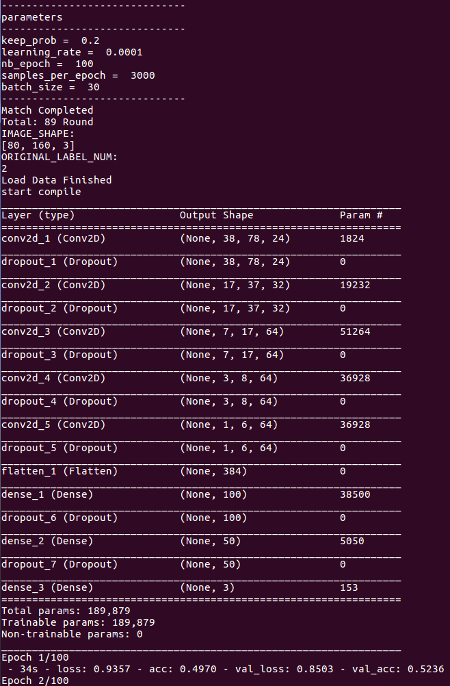

<!--
 * @Author: Sauron Wu
 * @GitHub: wutianze
 * @Email: 1369130123qq@gmail.com
 * @Date: 2019-10-15 15:51:43
 * @LastEditors: Please set LastEditors
 * @LastEditTime: 2020-02-28 11:05:18
 * @Description: 
 -->
# What you will learn
- Image preprocess.
- Train the AI model using keras.

# Why we need preprocess?
1. The initial images may not meet the requirements of the model input, for example, the image size is 1020\*720 while the input size is 160\*120. However, in HydraMini, since the images are collected by the car, we won't change the image size in preprocess part.
2. The model's performance highly depends on the input quality and there exists many ways to make the images more suitable for training such as normalization.

# Train the model
## Steps
1. First copy the images your generated(using the images from the car's collect function or from the simulator or from anywhere) to the `/home/xilinx/HydraMini/Host-Part/images` directory. Make sure the image size is what you want.
2. Run `python train.py --model=./model --read=./training_data_npz --output_num=2 --cut_head_size=40 --epoch=20`, it will use the processed images(in data generator function `batch_generator()`) and store the trained model in model directory. `cut_head_size` means how many pixels to cut, for example, if `cut_head_size=40`, the inital image size is 160\*120, then the result image size is 160\*80, `cut_head_size` is used to delete some useless information. You can also set the output number of the model by `--output_num=`(for ex.1 for steer only and 2 for steer&speed). `epoch` is the same in keras.

# Summary
Now, you have trained an AI model which inputs images and output control values. Next, if you want to run and accelerate the model in pynq, you will use DNNDK provided by xilinx to compile the .h5 model to .elf file.
