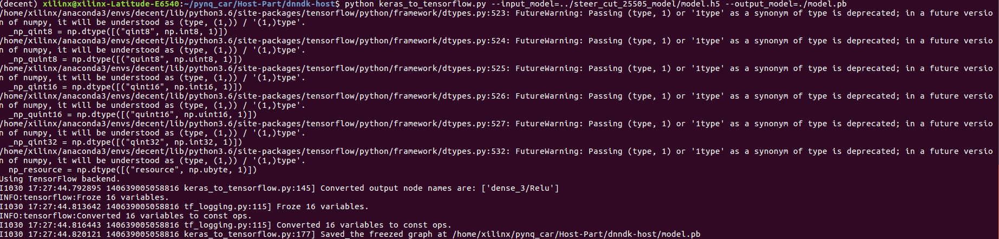
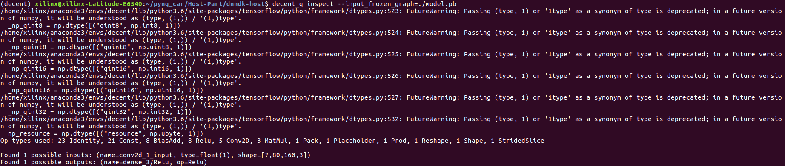
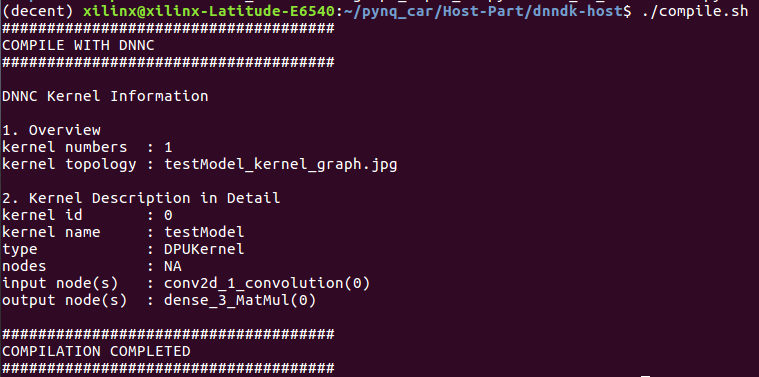

<!--
 * @Author: Sauron Wu
 * @GitHub: wutianze
 * @Email: 1369130123qq@gmail.com
 * @Date: 2019-10-15 16:38:14
 * @LastEditors: Please set LastEditors
 * @LastEditTime: 2020-02-17 20:33:18
 * @Description: 
 -->
# What you will learn
- How to use dnndk to do quantization to the model.
- How to use dnndk to compile the model(make DPU understandable .elf files)

# Steps
## Transfer keras model to tensorflow model
Transfer the .h5 model to .pb model using `python keras_to_tensorflow.py --input_model="../model/model.h5" --output_model="./model.pb"` and then print the model's info using `decent_q inspect --input_frozen_graph=./model.pb`.
`keras_to_tensorflow.py` transfers .h5 model to .pb model.

`decent_q inspect` command below prints the CONV_INPUT(input_nodes) name and CONV_OUTPUT(output_nodes) name of the model.

## Quantization and Compilation
1. Edit `quant.sh`, change the `--input_nodes conv2d_1_input --input_shapes ?,80,160,3 --output_nodes dense_3/Softmax` according to the info you get from `decent_q inspect` and the model input image size.  
2. Edit `graph_input_fn.py`, change the `CONV_INPUT` to `--input_nodes` in `quant.sh` and set the read path of glob to the result of `process_img`.
3. Edit `compile.sh`, make a name for your model by changing `--net_name`.
4. Run `./quant.sh && compile.sh`, it will do quantization to the trained model and build .elf files which can be used by DPU. You can see the info printed in your screen if nothing goes wrong. You must remember the info printed and they will be used later in Pynq-Part. 

5. Copy the .elf files in `compile/` to the `Pynq-Part/Car/model/` and then move the `Car` directory to your Pynq-Z2 board.

# Next
After copying the `Car` to the board, we will face the last step: Use the trained model for autonomous driving. Now turn back to `Pynq-Part` again.