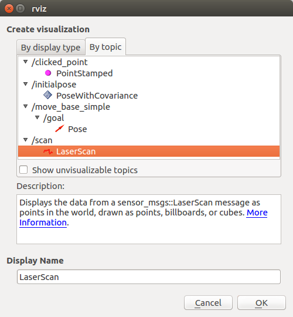

<!--
 * @Author: Sauron Wu
 * @GitHub: wutianze
 * @Email: 1369130123qq@gmail.com
 * @Date: 2019-10-28 15:12:00
 * @LastEditors: Sauron Wu
 * @LastEditTime: 2019-10-31 14:54:59
 * @Description: 
 -->
# ROS install in Pynq:
- In terminal type `export ROS_OS_OVERRIDE=ubuntu:bionic`.
- In terminal type `sudo sh -c 'echo "deb http://packages.ros.org/ros/ubuntu bionic main" > /etc/apt/sources.list.d/ros-latest.list'`
- Continue to follow instructions from [here](http://wiki.ros.org/melodic/Installation/Ubuntu) starting from “1.3 Set up your keys”.

# ROS install in Host:
Refer to ROS official website and download ROS according to your system.

#  Install laser driver for Leishen ls01d:
- `git clone https://github.com/leishen-lidar/LS01D` and copy the LS01D directory to your_workspace/src.
- Compile the code: `catkin_make`

# Get laser data:
- After building the driver, in your workspace run `./devel/lib/talker/talker` and the laser data will be published in /scan topic.
- You can use `ros echo /scan` to read the data.

# Show in your host using RViz:
- In the Pynq, run:
```shell
export ROS_MASTER_URI=http://192.168.5.108:11311
export ROS_HOSTNAME=192.168.5.108
```
**The URI and HOSTNAME should be yours.**
- In your host, run:
```shell
export ROS_MASTER_URI=http://192.168.5.108:11311
export ROS_HOSTNAME=192.168.5.100
```
**The URI should be the same as Pynq and HOSTNAME should be yours. If your Pynq use some other URI rules, please add that to `/etc/hosts`.**
- Start the laser publisher and in your Pynq, run `rviz -f laser_link`.
- In RViz, choose `Add` button and add `/scan`.

- Now you can see the laser data in RViz.
