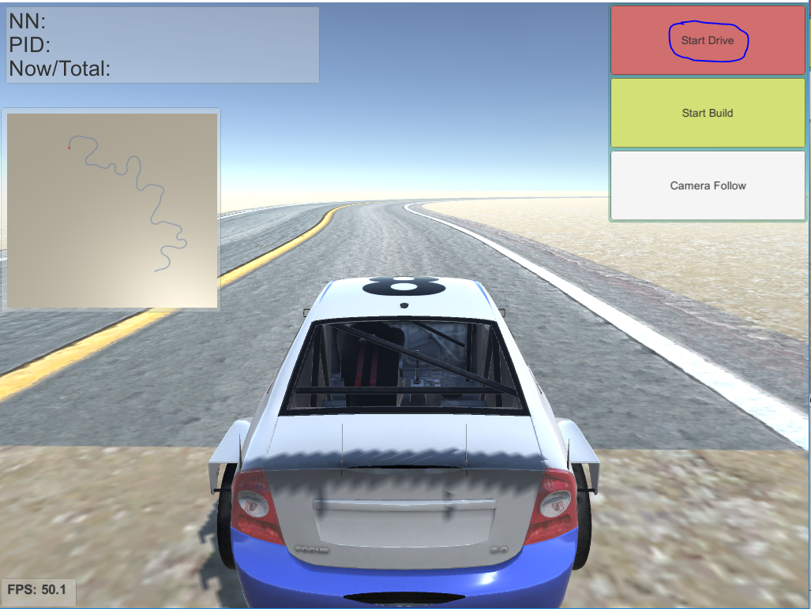

<!--
 * @Author: Sauron Wu
 * @GitHub: wutianze
 * @Email: 1369130123qq@gmail.com
 * @Date: 2019-09-23 10:12:28
 * @LastEditors  : Sauron Wu
 * @LastEditTime : 2020-01-19 11:53:32
 * @Description: 
 -->
# Introduction
The simulator we provided is based on the sdsandbox project. For more information about the initial project, please refer to [this](https://github.com/tawnkramer/sdsandbox). 

# What you can do with the simulator
- Collect training data
- Test your model or algorithms in the virtual world
- Build some exciting roads
- Play computer games only(not recommend)

## Setup

You need to have [Unity](https://unity3d.com/get-unity/download) installed, and python3+, tensorflow, keras is also needed.

You can both use linux version or windows version of Unity3d. 

## Using Unity3d to test your .h5 model

1) Start the prediction server with the pre-trained model. The server will run in local ip and port 9090. So you should set the client listen ip and port to the same, make sure the client can ping the server successfully. For example, if you run the `predict_server.py` in one PC whose ip is 192.168.43.101, you should set in HydraMini game 192.168.43.101. Please be aware that after changing the ip you should hit `NN Drive` to make it available.  

```bash
cd Virtual-Part
python src/predict_server.py --model=path-to-your-model/model.h5
```
 If you get a crash loading this model, you will not be able to run the demo. But you can still generate your own model. This is a problem between tensorflow/keras versions. 
 
1) Load the Unity project 

2) Hit the `Start Drive` button to start. Then hit `NN Drive`. If your connection fails, you should check your predict_server process. 

## Use & Modify predict_server.py
The script is used for build a server, the server will receive image data from the game and send the control commands back. Now let's see how it works.
- You can set the ip address and port by `--host= --port=`.
- We provide two control method for you to choose. You can set it by `--control_method=`. The code is in `on_parsed_outputs()`.
    1. Method `0` means the model output is softmax output. The output array has three elements. The first element means turn left, second means go straight, third means turn left. The throttle will always on.
    2. Method `1` means the model output is two value. The first means steer value, the second means the speed value. The max speed now is 6.
- When use `NN Drive` in the game, the image sent from the game to predict sever will be processed in `on_telemetry()`, now we will cut the top 40 lines of the image and each pixel will be normalized.

## Build Your Own Road using Scripts
- S n
    This means to build straight road for n length.
- DY n
    This means the road will curve, the bigger n means bigger angle.
- L n
    This always follows DY, means build road with the pre-set angle by DY, and the road will turn left, n is the length, the direction degrees will change the value set by DY every step.
- R n
    Like L, this means to turn right.
- BLOCK n1 n2, CONE n1 n2
    This will add a block/cone in the road. n1 means how far it is from the road(>0 means moving to left, <0 means moving to right), n2 means the orientation of it.

## How to Play
### Camera Follow
You can hit `Camera Follow` button to choose whether to follow the car. If not, you can use your mouse's right button to change the angle of view, use the roller to see in different height, use the direction key to move your view.
### Open the project in Unity3d
1) Load the Unity project Virtual-Part/simulator in Unity.  
  

2) Hit the start arrow in Unity to launch project.  


### Open the HydraMini.exe
1) Click `HydraMini.exe` to start the game, if in linux, run `./HydraMini.exe`.


2) Before start, you can set the window size, I don't recommend that you play in full-screen since you will have trouble exiting the game.


3) You can set the control method in `Input`, modify the Horizontal and Vertical buttons as you like(now is `WASD`), you can also use a joystick to control. Since the direction keys are for view change, you should not use them for controlling the car.


### Build Road
1) Select `Start Build` to enter the build interface.


1) Use `Build Random` to generate a random road, use `Load Script` to open a redefined script and hit `Build Script` to build the script. We provide some scripts in `pynq_car\Virtual-Part\simulator\Road Scripts` for reference. Here is one example:


3) Hit `Next Texture` to change the road style.


### Control the Car
1) In the main menu, select `Start Drive` to start drive.


2) In the drive interface, the top 3 buttons means how to control the car. `PID Drive` means using PID algorithm to control the car; `NN Drive` means using neural network to control the car, in this mode you should start `predict_server` and set the ip(default is 127.0.0.1) first; `Human Drive` means using your keyboard or joystick to control the car, `WASD` or any settings can be used. You can set the control method while entering the game.
When you decide to collect some training data, you should hit `Set Log Dir` to choose the directory to store the data, then you can enter a number in `Enter how many` to set the max number of frames you want to collect, the record process will stop when reach max number, the default number is 50000. Hit `Start Record or Stop Record` to continue or stop the record process. I recommend that you start recording after starting the car. Also you can hit `Back to Start Point` button to move the car to the start point, this is useful if your road is not a circle.


# The Log style
The log is the same as real car: `Img Name,Steer,Speed`, the image size is 160*120.

## If you want to make some changes to the simulator, please read custom_simulator.md.


