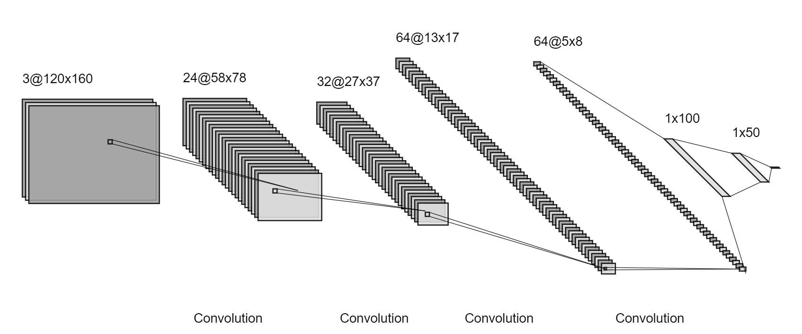
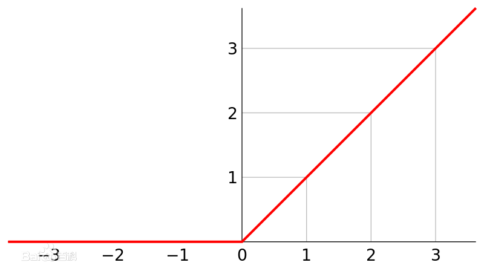
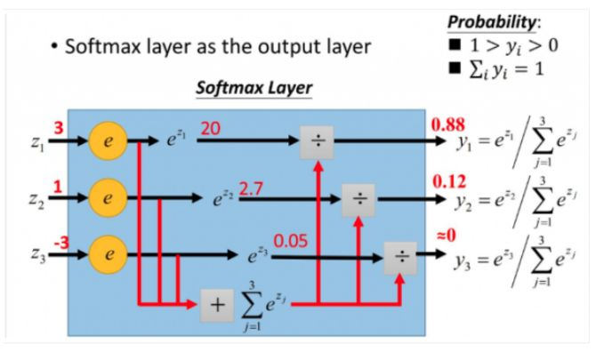

# Two examples
## Base Structure
They have the same input: preprocessed image, but different output.

## Regression model
```python
model.add(Dense(OUTPUT_NUM,activation="relu"))

model.compile(optimizer=keras.optimizers.Adam(lr=learning_rate),loss='mean_squared_error')
```
The output layer of the model use `relu` as the activation function. When compiling the model, the loss function is `mean_squared_error`.

The final outputs are two float values. One steer value and one speed or throttle value. This model can provide a more accurate control over the car, but it requires higher quality training data and a better car control system.
## Classification model
```python
model.add(Dense(OUTPUT_NUM,activation='softmax'))

model.compile(optimizer=keras.optimizers.Adam(lr=learning_rate), metrics=['accuracy'], loss='categorical_crossentropy')
```
The output layer of the model use `softmax` as the activation function. When compiling the model, the loss function is `categorical_crossentropy`.

The final output is an array, the values in the array represent the probability of different categories. The category with the highest probability should be the final choice. This model's training data is easy to collect and it doesn't need a high-quality car, but its control is extensive.